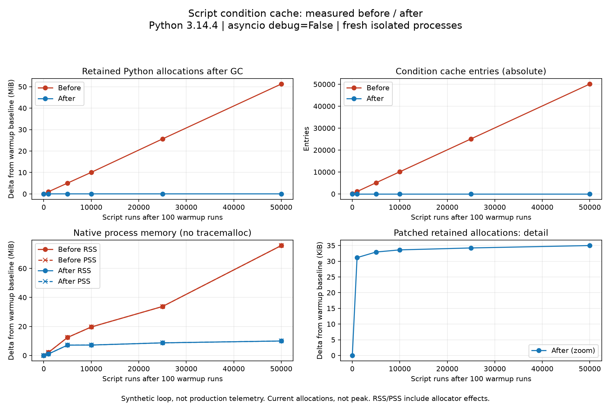

# Script condition cache: isolated before/after evidence

This evidence accompanies a **fork-local draft for human review**, not an upstream submission or a production deployment. AI-assisted preparation was explicitly requested; human approval remains required before upstream submission.

## Cause and scope

The old cache key stringifies configuration values. A Template representation includes its changing render count, so repeated condition actions produce new keys and retain new condition checkers. The fix uses `id(config)`; Script keeps these configuration objects alive for the cache lifetime. Separate equal configurations intentionally remain separate cache entries. Asynchronous cold-lookup races in other condition factories are outside this minimal fix.



## Measurement method

- Before: parent `ef3acfda245dbd013082678d72905eb826f035de`; after: `382b28ec8244d3ef3bee0f219b22b85860db4a6e`.
- Four fresh processes run **sequentially**: before/after with tracemalloc, and before/after without it for native RSS/PSS. All share the same Python 3.14.4 environment and dependencies. The project requests 3.14.5; this is a local compatibility limitation.
- The harness reads the exact committed `homeassistant/helpers/script.py` via `git show` and executes it in its normal module namespace before constructing Script. No working-tree edits, replacement condition implementation, integrations, device actions, or production connections.
- Real `Script.async_run` calls evaluate one template condition and optionally fire a synthetic event. Variables alternate true/false; every run asserts the expected event outcome. Each process verifies 50,100 executions and cache clearing on unload.
- Warm up 100 executions, then sample at 0 / 1,000 / 5,000 / 10,000 / 25,000 / 50,000 additional runs. Each sample follows `gc.collect()`. Asyncio debug is explicitly disabled and recorded.
- Retained bytes are **tracemalloc CURRENT minus baseline CURRENT**, not peak or snapshot totals. Small retained measurement bookkeeping is included. Tracing begins after warmup, so preexisting warmup allocations are excluded. The cache count is absolute, including warmup.
- Native RSS/PSS come from `/proc/self/smaps_rollup` in separate non-traced processes. Traced-process RSS/PSS are retained in JSON but not used in the native panel. Limits per process: 1.5 GiB address space, 90 CPU seconds; caller uses a 110-second wall timeout.
- One sequential trial per variant/mode; no error bars or broad performance claims. Checkpoints alter GC cadence versus an uninterrupted production loop. Timing is not a throughput benchmark.

## Results

| Additional runs | Before retained bytes | After retained bytes | Before cache entries | After cache entries |
|---:|---:|---:|---:|---:|
| 0 | 0 | 0 | 100 | 1 |
| 1,000 | 1,088,341 | 31,890 | 1,100 | 1 |
| 5,000 | 5,291,868 | 33,716 | 5,100 | 1 |
| 10,000 | 10,549,479 | 34,415 | 10,100 | 1 |
| 25,000 | 26,886,709 | 35,041 | 25,100 | 1 |
| 50,000 | 53,726,031 | 35,828 | 50,100 | 1 |

At 50,000 runs native RSS and PSS deltas were both **79,409,152 bytes before** and **10,452,992 bytes after**. Patched RSS is **not perfectly flat**. Allocator arenas, transient allocations, libraries and tracing overhead mean live Python allocations and process residency are different measures. Memory is not zero after the fix.

A rising production graph supports the symptom, not the solution. This controlled synthetic before/after comparison provides causal evidence for eliminating this cache-growth mechanism, **not proof that all production memory growth comes from this cache or will disappear**.

Prior independent 10,000-run snapshot evidence (preserved locally) measured 10,540,498 versus 33,935 retained bytes. That used snapshot differences rather than this curve's current-allocation deltas; the numbers should not be treated as identical measurements.

## Local checks already performed on the fix

- Five new regression cases fail before and pass after.
- All 215 existing-plus-new script tests pass after environment setup, optional dependencies and translations.
- All-files checks: Ruff check/format, codespell, zizmor, JSON, branch check, YAML and prettier pass. Mypy stops on a duplicate `homeassistant.util.event_type` module (`.py` and `.pyi`). **This is not a full passing CI run.**
- Human understanding/review checkboxes remain unchecked for review. No upstream PR or production change is authorized.

## Reproduce

Use a disposable Linux Home Assistant Core checkout with the fix and its parent available. Run the repository's `script/setup` to create the development environment first; use that environment's Python. The original local run used Python 3.14.4; dependency pins are in the corresponding Core commit. A different interpreter/dependency/platform can change exact byte counts.

```bash
export CORE=/path/to/disposable/ha_core
export PYTHON=/path/to/development/venv/bin/python
# Run from this evidence directory. Each invocation starts a fresh process.
for variant in before after; do
  timeout 110s "$PYTHON" benchmark_curve.py --core "$CORE" --variant "$variant" --output "$variant-traced-sequential.json"
  timeout 110s "$PYTHON" benchmark_curve.py --core "$CORE" --variant "$variant" --native --output "$variant-native-sequential.json"
done
# Use a separate plotting environment if matplotlib is absent in Core's venv.
python plot_curve.py
```

Raw JSON and PNG/SVG are kept on a separate evidence branch so generated artifacts do not enter the minimal Core fix diff. Files contain only synthetic inputs, commit identifiers and measurement data; no production names, configuration, credentials or telemetry.
